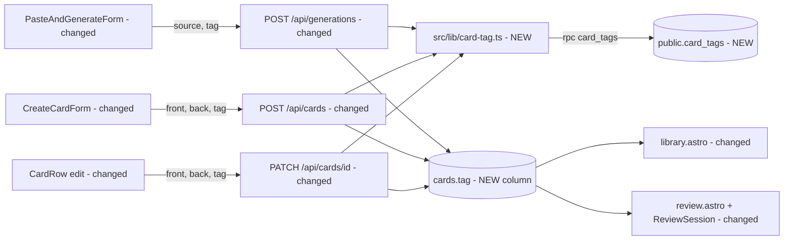

# Lesson tag on cards

**Status:** ready to plan
**Source brief:** `.ai/specs/briefs/2026-10-10-card-lesson-tag.md`

## 📝 TLDR

A learner who builds cards lesson by lesson cannot tell, looking at a card in `/library`, which lesson it
came from. **Proposed (future behavior):** every card carries at most one optional, free-text **tag**
(`cards.tag`, ≤ 40 characters). The tag is set once per AI-generation batch, or typed at manual create,
and is editable on a saved card. `/library` shows it on each card and can filter by tag or by "No tag".
`/review` shows it only after the answer is revealed. Review ordering and Leitner scheduling do not change.

The need is provenance, not grouping: there are no per-tag review sessions, because mixing all due cards is
the point of the Leitner box.

## 📝 Problem Statement

Today a card is `front`, `back`, a status and schedule fields (`supabase/migrations/20260527150510_cards_and_account_deletion.sql:16-30`).
Nothing records where a card came from. The only workaround is hand-typed text prefixes in `front`, which
works for the free-text search (`library.astro` `orFilter` over `front`/`back`) but is not a structured
filter, pollutes the prompt that review shows, and cannot be hidden until reveal.

## 📝 Proposed Solution

One nullable text column on `cards`. A tag is a label, not an entity: no table, no CRUD, no ownership FK.

**Rejected alternatives** (from the brief): *decks* (table, CRUD, ownership FK, delete semantics — more
machinery than provenance needs); *do nothing / text prefixes* (searchable but not a structured filter, and
visible in the review prompt).

**Non-goals:** decks or hierarchy (course → lesson), multiple tags per card, review scoped by tag, a
dashboard tag summary, bulk retag/rename, backfill or rollback for existing rows.

## 📝 Architecture

No new module. The tag rides along existing paths; one shared helper and one SQL function are new.



Takeaway: `finalize_drafts` and `/api/generations/save` are untouched — the function only flips
`status`/`next_due_at`, so a draft's tag survives finalization unchanged. The review query changes by one
selected column only; its filter and ordering are frozen.

## 📝 Data Model

New migration `supabase/migrations/<timestamp>_cards_tag.sql`:

```sql
alter table public.cards
  add column tag text
    check (tag is null or (tag = btrim(tag) and char_length(tag) between 1 and 40));

create index cards_user_id_tag_idx on public.cards (user_id, tag) where tag is not null;

-- distinct tags of the caller, oldest-first-used first; RLS scopes to the owner
create function public.card_tags()
returns setof text
language sql
stable
security invoker
set search_path = ''
as $$
  select tag from public.cards where tag is not null group by tag order by min(created_at), tag;
$$;

grant execute on function public.card_tags() to authenticated;
```

- Existing rows get `NULL` ("No tag"). No backfill. No rollback/down migration is designed (existing cards
  are throwaway test data).
- `security invoker` + the existing `cards_select_own` policy confine `card_tags()` to the caller's rows; a
  cross-user leak would need the policy to change, so the integration test asserts isolation (see Steps).
- The check constraint is the last line of defense; the API validates first and returns a friendly error.
- Existing RLS policies cover the new column; no policy change. Account deletion removes cards wholesale, so
  tags need no separate sweep.
- **The migration ships in its own reviewed PR and is never applied as part of spec or implementation
  tasks.** Code that selects `tag` fails against a database without the column, so deploy order is:
  migration PR merged and applied → code PR merged.

## 📝 API Contracts

Shared helper `src/lib/card-tag.ts` (pure parsing + canonicalization; the only place tag rules live):

- `parseTag(raw: unknown): { ok: true; tag: string | null } | { ok: false }` — `undefined` → absent (caller
  decides), `null` or a string that trims to empty → `null` (no tag), a non-string → invalid, trimmed length
  > 40 **code points** (`[...tag].length`, matching Postgres `char_length`) → invalid.
- `canonicalizeTag(supabase, tag)` — calls `rpc("card_tags")` and returns the existing spelling whose
  `toLowerCase()` equals the input's, else the input as typed. "lesson 5" → "Lesson 5" when "Lesson 5" exists.
  Because `card_tags()` orders by earliest use, the first-used spelling wins if variants already exist.

| Endpoint | Change |
| --- | --- |
| `POST /api/generations` | Body gains optional `tag`. Validated **before** the OpenRouter call so a bad tag never spends a generation. Canonicalized once; the same value is written to every draft row. |
| `POST /api/cards` | Body gains optional `tag`; response `card` gains `tag`. |
| `PATCH /api/cards/[id]` | Body gains optional `tag`: **absent = unchanged**, `null`/`""` = clear, string = set (canonicalized). Existing clients that send only `front`/`back` keep working. |

New error: `400 { error: "invalid_tag", message: "Tag must be at most 40 characters." }`. All other
status codes, auth and read-only guards are unchanged.

## 📝 UI/UX

Prototype: none — text-only spec (see PR for why visuals were skipped).

- **Tag input** (`/generate` form, `CreateCardForm`, `CardRow` edit): a single-line text input labelled
  "Lesson tag (optional)", `maxLength={40}`, bound to an `<datalist>` of the user's existing tags — native
  autocomplete, no new component library. It needs a small `TagField` in `src/components/ui/` (label +
  `<input list>` + `<datalist>`), because `Field` is textarea-only by contract.
- **Suggestions** are loaded server-side by the page (`rpc("card_tags")`) and passed as a prop; no client
  fetch. After a create/edit the page reloads (existing `window.location.assign("/library")` pattern), so
  the list refreshes.
- **`/generate`:** one tag field in `PasteAndGenerateForm`, applied to the whole batch. Not changed after
  generation; fix a typo by editing the saved card.
- **`/library`:** each `CardRow` shows the tag as a small muted chip under the back text, omitted when
  `null`. A filter `<form method="get">` beside the search offers "All", "No tag" and each existing tag;
  it composes with `q` and pagination (`buildHref` carries it). URL contract: `?tag=<exact tag>` or
  `?no_tag=1` (wins over `tag`). The count query and page query share one filter helper so counts match.
- **`/review`:** `DueCard` gains `tag: string | null`; `ReviewSession` renders it inside the existing
  `revealed &&` block next to the back. It is not in the DOM before reveal, so it cannot hint at the answer
  or leak through a screen reader.
- **Accessibility:** the label is real, the datalist is a progressive enhancement over a plain input, the
  chip is text (not colour-only).

## 📝 Edge Cases & Failure Scenarios

| Case | Behavior |
| --- | --- |
| Tag is whitespace only / empty | Stored as `NULL` (no tag). |
| Tag > 40 characters | `400 invalid_tag`; the input also has `maxLength=40`. Generation: no OpenRouter call is made. |
| Case/whitespace variants ("lesson 5 " vs "Lesson 5") | Canonicalized to the existing spelling server-side, regardless of what the client sent. |
| Two concurrent requests introduce two new spellings | Both are stored (no unique constraint — a tag is not an entity). Later writes canonicalize to the earlier-used one; manual edit fixes the loser. Accepted. |
| `card_tags()` RPC fails during write | Fail closed with `500 db_error`; never write an un-canonicalized tag on error. |
| Filter value matches no card | Existing `LibraryEmpty` with the query state; the filter UI stays visible. |
| Tag contains `%`, `_`, `<`, quotes | Filter uses `eq`, not `ilike`; rendering is escaped by React/Astro. |
| Page loaded before migration is applied | Selecting `tag` errors → existing `loadError` notice. Prevented by deploy order above. |
| Read-only (pending-deletion) account | Writes already blocked by `readOnlyGuard`; the tag display and filter still work. |

## 📝 Risks & Impact Review

- **Schema change on a shared table (medium).** Nullable column, no default, partial index: online-safe and
  additive. Rollback is `drop column`, which this spec deliberately does not design (throwaway data).
- **Test DB sharing (medium).** E2E specs use the app's Supabase DB. Specs must use a unique
  timestamp-suffixed tag and delete their cards in cleanup; the filter test must select only its own tag so
  parallel runs do not collide.
- **Data isolation.** `card_tags()` is `security invoker` over RLS; covered by a two-user integration test.
- **Review-prompt leak.** The only product risk: a tag like "Chapter on mitosis" hinting at the answer.
  Mitigated by render-after-reveal; asserted by test.
- No public API break: `tag` is additive and optional everywhere.

## 📋 Phasing

1. **Phase 0 — Migration PR** (separate, reviewed, applied before Phase 1 merges).
2. **Phase 1 — Write path + display:** helper, API changes, tag inputs, library display, review reveal.
3. **Phase 2 — Library filter.**

Phases 1 and 2 are independently shippable after Phase 0.

## 📋 Implementation Plan

### Phase 0 — Migration (own PR; not applied by the implementing task)

1. Add `supabase/migrations/<timestamp>_cards_tag.sql` per Data Model. Verify locally on a scratch DB:
   constraint rejects `''`, `' x'`, 41 chars; `card_tags()` returns only the caller's tags.

### Phase 1 — Write path, library display, review reveal

2. `src/lib/card-tag.ts` + `card-tag.test.ts`: `parseTag` (absent/null/empty/whitespace/40 vs 41 code
   points incl. a multi-code-point character) and `canonicalizeTag` (case + whitespace match, first-used
   wins, RPC error propagates, no match returns input).
3. `POST /api/cards` + `src/pages/api/cards.test.ts`: tag stored, canonicalized, empty → `NULL`, 41 chars →
   400, RPC error → 500, existing tests unchanged.
4. `PATCH /api/cards/[id]` + tests: absent unchanged, `null`/`""` clears, set canonicalizes; extend
   `[id].integration.test.ts` with the two-user fixture (user B cannot see or reuse user A's tags via
   `card_tags()`).
5. `POST /api/generations` + `generations.test.ts`: tag validated before the OpenRouter call (mock not
   invoked on 400); the same canonical tag is on every inserted draft; `save`/`finalize_drafts` untouched —
   assert a saved draft keeps its tag.
6. `src/components/ui/TagField.tsx` (+ test): labelled input with datalist and `maxLength`.
7. Wire tag inputs into `PasteAndGenerateForm`, `CreateCardForm`, `CardRow` edit; pages pass `tags` from
   `rpc("card_tags")`. `CardRow` shows the chip when set. Update `library-paper.test.ts` if it pins markup.
8. `review.astro` selects `tag`; `ReviewSession` shows it inside the revealed block. Unit test: tag text
   absent before reveal, present after.
9. E2E (per `/10x-e2e`, `tests/e2e/`): create a card with a unique tag in `/library`, see it on the card;
   in `/review` the tag is not visible until Show answer, then is. Cleanup deletes the card.

### Phase 2 — Library filter

10. Extract the shared `status`/`q`/tag filter used by the count and page queries in `library.astro`; add
    `tag` / `no_tag` params, preserved by `buildHref`. Unit-test the filter builder.
11. Filter form UI (All / No tag / each tag). E2E: filter by the spec's own unique tag shows only its card;
    "No tag" excludes it.

### Verification (every phase)

`npm run typecheck`, `npm run lint`, `npm run build`, `npm test`, `npm run test:integration`, and
`npm run test:e2e` (on a free port) once the migration is applied to the test database.

## Resolved assumptions (autonomous defaults)

The brief's Resolved-unknowns table pre-answered the product questions. These remaining gaps were resolved
with the most reversible default:

| # | Question | Applied default | Why | Confirm? |
| --- | --- | --- | --- | --- |
| Q1 | Normalize internal whitespace ("Lesson  5")? | No — trim only; internal spacing kept as typed | Smallest rule that matches the brief ("surrounding whitespace"); easy to tighten later | reversible |
| Q2 | Which cards feed autocomplete/canonicalization? | All of the user's cards incl. drafts, via one `card_tags()` function | One source of truth for both; draft tags are real pending input | reversible |
| Q3 | Which spelling wins when variants already exist? | Earliest-used (`min(created_at)`) | Deterministic; matches "existing spelling wins" | reversible |
| Q4 | PATCH semantics for `tag` | Absent = unchanged, `null`/`""` = clear | Keeps current clients working | reversible |
| Q5 | Guard against concurrent duplicate spellings? | No unique constraint or locking | A tag is a label, not an entity; edit fixes it | reversible |
| Q6 | Does text search `q` match tags? | No; tag filter is separate | Avoids changing the frozen `orFilter` | reversible |
| Q7 | Filter URL contract | `?tag=<exact>` and `?no_tag=1` (wins) | Plain GET form, bookmarkable, no sentinel collision with a real tag | reversible |
| Q8 | Edit a batch's tag between generation and save? | No; edit saved cards instead | Keeps drafts UI untouched | reversible |
| Q9 | Length unit for the 40-character limit | Unicode code points, enforced in API and DB | Matches Postgres `char_length` | reversible |

No `⚠ NEEDS HUMAN CONFIRMATION` rows.
