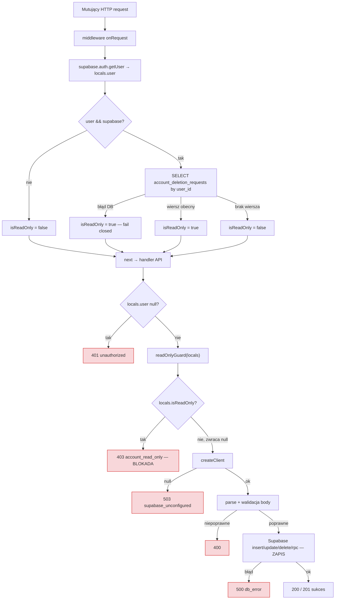

# Research: Account-retention / write-lock flow for mutating operations

**Date**: 2026-06-17
**Researcher**: Rafal S
**Git Commit**: 2dec3c1be922741ddfb60eff2c238da471982e3c
**Branch**: learning/m4-architect
**Repository**: 10xCards (https://github.com/rafsaw/10xCards)

## Research Question

Przeanalizuj przepływ write-lock / account-retention w 10xCards, zwracając uwagę na obszary z `context/map/repo-map.md`. Trzy osie: (1) trace e2e od mutującego requestu przez sprawdzenie write-lock do zapisu/blokady (cards, generations, reviews); (2) luki w testach mutujących endpointów i gałęzi write-lock; (3) blast radius — co musi zmienić się razem przy zmianie inwariantu. Tylko opis obecnego stanu — bez propozycji refaktoru. Raport z sekcjami **Feature overview** i **Technical debt**, z rozdzieleniem **evidence / inference / unknown**.

## Legenda dowodu

- **[evidence]** — potwierdzone w kodzie (z `file:line` lub git hash).
- **[inference]** — interpretacja na podstawie dowodów.
- **[unknown]** — niepotwierdzone lub poza zasięgiem obecnej analizy.

---

## Summary

Write-lock to **globalny inwariant zapisu**: obecność wiersza w `account_deletion_requests` ⇒ konto oczekuje na usunięcie ⇒ tryb read-only. Inwariant jest egzekwowany w trzech warstwach: **obliczenie** stanu w `src/middleware.ts` (`locals.isReadOnly`), **strażnik** w `src/lib/account-retention.ts` (`readOnlyGuard` → 403 `account_read_only`), oraz **wezwanie** strażnika w każdym mutującym endpoincie tuż po sprawdzeniu usera. **[evidence]**

Stan jest **spójny i poprawny po stronie handlerów**: wszystkie 7 mutujących endpointów danych wołają strażnika *przed* zapisem, w identycznej kolejności, a jedyne dwa niestrzeżone endpointy mutujące (`account/cancel`, `account/delete`) pomijają strażnika **celowo i z komentarzem** — bo zarządzają samym stanem retencji (escape hatch). Brak „zapomnianego" strażnika wśród istniejących endpointów. **[evidence]**

Główny dług nie leży w handlerach, lecz w **warstwie obliczeniowej i jej testach**: cała logika `middleware.ts` (odczyt wiersza, `!!row`, fail-closed na błędzie DB, brak porównania `retention_until < now()`) **nie ma żadnego pokrycia testami**, a sztandarowy test kontraktowy `retention-write-lock.test.ts` chroni jedynie *umieszczenie* strażnika w handlerach (na sfałszowanym `locals`), nie *poprawność obliczenia* `isReadOnly`. Deklarowane „auto-wykrycie nowego endpointu bez strażnika" jest w rzeczywistości **ręczne** (hand-maintained tabela `writeRoutes`). **[evidence]**

---

## Detailed Findings

### A. Obliczenie stanu read-only — `src/middleware.ts`

Sekwencja w `onRequest`:
- `supabase.auth.getUser()` → `locals.user` — `middleware.ts:11-13` **[evidence]**
- Jeśli user + supabase: PK-lookup `account_deletion_requests` po `user_id`, `select("retention_until").maybeSingle()` — `middleware.ts:21-26` **[evidence]**
- Na błędzie DB: **fail-closed**, `isReadOnly = true`, `retentionUntil = null` — `middleware.ts:28-32` **[evidence]**
- W przeciwnym razie: `isReadOnly = !!row`, `retentionUntil = row?.retention_until ?? null` — `middleware.ts:34-35` **[evidence]**
- Brak usera / brak supabase: `isReadOnly = false` — `middleware.ts:37-40` **[evidence]**

Kluczowy niuans projektowy: **read-only zależy wyłącznie od obecności wiersza, nie od daty.** Komentarz `middleware.ts:21-26` mówi wprost: „row exists = pending & cancellable, even past retention_until". Z `account_deletion_requests` pobierane jest tylko `retention_until` — nigdy nie porównywane z `now()` w runtime. **[evidence]**

### B. Strażnik — `src/lib/account-retention.ts`

- `readOnlyGuard(locals)` zwraca `null` gdy `!locals.isReadOnly` (zapis dozwolony), w przeciwnym razie Response 403 z body `{ error: "account_read_only", message: "...pending deletion and is read-only..." }` — `account-retention.ts:5-19` **[evidence]**
- `formatRetentionDate(iso)` — pojedyncze źródło formatu daty dla bannera i ustawień; `null` → `"soon"` — `account-retention.ts:24-29` **[evidence]**

### C. Trace e2e — per-endpoint (request → guard → write/block)

Tabela kolejności w każdym handlerze. Wzorzec jest jednolity: `user null-check → readOnlyGuard → createClient → walidacja body → mutacja`. **[evidence]**

| Endpoint | Metoda | user-check | `readOnlyGuard` | mutacja | guard przed mutacją? |
|---|---|---|---|---|---|
| `src/pages/api/cards.ts` | POST | `:28-29` | **`:33-34`** | insert `:59-64` | tak |
| `src/pages/api/cards/[id].ts` | PATCH | `:25-26` | **`:30-31`** | update `:62-66` | tak |
| `src/pages/api/cards/[id].ts` | DELETE | `:81-82` | **`:86-87`** | delete `:102-106` | tak |
| `src/pages/api/generations.ts` | POST | `:19-20` | **`:24-25`** | insert `:82` | tak |
| `src/pages/api/generations/save.ts` | POST | `:34-35` | **`:39-40`** | rpc `finalize_drafts` `:87-90` | tak |
| `src/pages/api/generations/discard.ts` | POST | `:13-14` | **`:18-19`** | delete `:26` | tak |
| `src/pages/api/reviews.ts` | POST | `:18-19` | **`:23-24`** | update `:60-69` | tak |
| `src/pages/api/account/cancel.ts` | POST | `:18-19` | **NIEOBECNY** (celowo, `:11-14`) | delete `:27` | n/d (escape hatch) |
| `src/pages/api/account/delete.ts` | POST | `:20-21` | **NIEOBECNY** (celowo, `:13-16`) | insert `:33-35` | n/d (escape hatch) |

Wszystkie wartości **[evidence]** (sub-agent „Trace e2e", pełny odczyt plików).

Szczegółowe sekwencje dla trzech wymaganych ścieżek:

**cards.ts POST:** user `:28` → `!user`→401 `:29-31` → `readOnlyGuard`→403 jeśli locked `:33-34` → `createClient`/503 `:36-39` → parse+walidacja `front`/`back` `:41-54` → `insert` `:59-64` → 201/500. **[evidence]** Strażnik **przed** stworzeniem klienta, walidacją i insertem.

**generations.ts POST:** user `:19-22` → `readOnlyGuard` `:24-25` → config OpenRouter/503 `:27-29` → walidacja `source` (200–8000) `:31-42` → `generateCandidateCards` (LLM, 60s) `:44-68` → `createClient`/503 `:70-73` → `insert` (status `draft`) `:82` → 200/500. **[evidence]** Strażnik **przed** kosztownym wywołaniem LLM — konto read-only jest blokowane zanim wyda się request do modelu. **[inference]**

**reviews.ts POST:** user `:18-21` → `readOnlyGuard` `:23-24` → `createClient`/503 `:26-29` → walidacja `cardId`/`rating`/`currentBox` `:31-51` → `schedule(currentBox, rating)` (Leitner) `:53` → `update ... .eq("status","saved").eq("repetition_count", currentBox)` `:60-72` → 200 `{applied}`/500. **[evidence]**

### D. Escape hatches — celowy SKIP strażnika

- `account/cancel.ts` — brak importu/wywołania `readOnlyGuard`; user-check `:18-19` → `createClient` `:21` → `delete account_deletion_requests` `:27`. Komentarz `:11-14` wprost: „cancel must work while the account is read-only". Usunięcie wiersza to dokładnie sposób wyjścia z read-only. **[evidence]**
- `account/delete.ts` — brak strażnika; user-check `:20-21` → `createClient` `:23` → `insert account_deletion_requests` `:33-35`, obsługa duplikatu 23505 `:43-54`. Komentarz `:13-16`: „a pending user re-requesting is a no-op". **[evidence]**
- Trasy auth (`signin`/`signup`/`signout`) także nie wołają strażnika — poprawnie, bo zmieniają stan sesji, nie dane usera; nie są jednak w tabeli exempt testu ani osobno pokryte. **[evidence: brak `readOnlyGuard`/`isReadOnly` w `src/pages/api/auth`]**

### E. Diagram przepływu (generalized)

Escape-hatch (cancel/delete) pomijają węzeł `E` — idą prosto z user-check do `createClient` i mutacji. **[evidence]**

### F. Pokrycie testami

Konfiguracja runnera **[evidence]**: `package.json:15-17` — `test`=`vitest run` (hermetyczny), `test:integration`=`vitest run --config vitest.integration.config.ts`, `test:e2e`=`playwright test`. `vitest.config.ts:18` **wyklucza** `**/*.integration.test.ts`; `vitest.integration.config.ts:21-24` **włącza tylko** `**/*.integration.test.ts` i ładuje pełny `.env` (z `SUPABASE_SERVICE_ROLE_KEY`). Dwie rozłączne pule: `*.test.ts` = hermetyczne, `*.integration.test.ts` = realna Supabase.

Klasyfikacja:

| Plik | Klasa | Uzasadnienie |
|---|---|---|
| `src/pages/api/retention-write-lock.test.ts` | **kontraktowy / guardrail** | Importuje **realne** handlery `:8-15`, mockuje tylko `@/lib/supabase` `:29` i `astro:env/server` `:31`. Brak DB. Tabela 7 tras + 2 exempt; behawioralny inwariant cross-route, nie unit. **[evidence]** |
| `test/integration/harness.integration.test.ts` | **integracyjny** | Realna fixture dwóch userów + RLS, B nie czyta wiersza A. Realna DB. **[evidence]** |
| `test/no-service-role-in-src.test.ts` | **kontraktowy (statyczny)** | Brak DB; skanuje `src/**` `:46-53`, fail gdy `service_role` w module. **[evidence]** |
| `test/smoke.test.ts` | **smoke** | Trywialny, alias `@/*`. **[evidence]** |
| `src/pages/api/cards.test.ts` | **unit (hermetyczny)** | Mock DB+env, asercja payloadu insert + odrzucenie pustych. **[evidence]** |
| `src/pages/api/cards/[id].integration.test.ts` | **integracyjny** | Realne RLS, cross-user PATCH/DELETE → 404. **[evidence]** |
| `src/pages/api/generations.test.ts` | **unit/hybryda (hermetyczny)** | Realny parse OpenRouter nad stubowanym `fetch`, mock DB+env. **[evidence]** |
| `src/pages/api/reviews.test.ts` | **unit (hermetyczny)** | Asercja payloadu update + Leitner + odrzucenie złych wejść. **[evidence]** |
| `src/pages/api/reviews.integration.test.ts` | **integracyjny** | Realne RLS, review B na karcie A → `applied:false`. **[evidence]** |

Macierz pokrycia gałęzi write-lock (`locals` sfałszowany: `retention-write-lock.test.ts:93`):

| Endpoint | read-only→403 | writable→proceeds | Test (file:line) |
|---|---|---|---|
| cards POST | tak | tak | `retention-write-lock.test.ts:114,124-141` |
| cards/[id] PATCH | tak | tak | `:115,124-141` |
| cards/[id] DELETE | tak | tak | `:116,124-141` |
| generations POST | tak (×2) | tak | `:117,124-141` + `generations.test.ts:137-142` (403) i `:130-135` (401) |
| generations/save POST | tak | tak | `:118,124-141` |
| generations/discard POST | tak | tak (osiąga faked delete → 302) | `:119,124-141` |
| reviews POST | tak | tak | `:120,124-141` |
| account/cancel POST | EXEMPT (asercja: NIE blokowany) | n/d | `:145,150-155` |
| account/delete POST | EXEMPT (asercja: NIE blokowany) | n/d | `:146,150-155` |

Co test guardrail **udowadnia [evidence]**: przy poprawnie obliczonym `isReadOnly` wszystkie 7 handlerów honoruje go (403 + zero wywołań mutujących klienta — `:131-133`) i nie short-circuit'ują gdy writable; 2 trasy lifecycle pozostają użyteczne w read-only.

Czego **NIE** udowadnia **[evidence/inference]**:
1. Że `isReadOnly` jest *poprawnie obliczany* — cała `middleware.ts` nietestowana.
2. Że *przyszły* zapomniany strażnik zostanie złapany — detekcja zależy od ręcznego dodania trasy do tabeli `writeRoutes` (`:113-121` hand-maintained; komentarz `:5-7` „manual check 3.3"; brak skanu FS, w przeciwieństwie do `no-service-role-in-src.test.ts`).
3. Że ścieżka writable faktycznie wykonuje udany zapis — pozytywna kontrola sprawdza tylko `status !== 403` (`:139`); body celowo steruje w walidację po strażniku (`:108-112`).
4. Kolejność null-user → guard dla 6 z 7 tras (test zawsze podaje usera `:93`; tylko `generations.test.ts:130-135` testuje realny 401).

### G. Blast radius — co zmienia się razem

| Powierzchnia | Pliki (file:line) | Co pęka przy zmianie inwariantu | Źródło |
|---|---|---|---|
| Definicja locka | `account-retention.ts:5-19`, `:24-29` | Kształt 403, kontrakt „writable⇒null", format daty | [evidence] graf+read |
| Typ `App.Locals` | `src/env.d.ts:2-6` (`isReadOnly: boolean`, `retentionUntil: string\|null`) | Każdy dostęp `locals.isReadOnly` — TS/ESLint odrzuca | [evidence] env.d.ts:4-5 |
| Obliczenie locka | `middleware.ts:18-40` | Reguła „obecność wiersza = read-only" + fail-closed | [evidence] |
| Endpointy mutujące (fan-in) | `cards.ts:33`, `cards/[id].ts:30,86`, `reviews.ts:23`, `generations.ts:24`, `generations/save.ts:39`, `generations/discard.ts:18` | 7 ręcznie wpiętych call-site'ów; brak centralnego interceptora | [evidence] grep |
| Escape hatches | `account/delete.ts:33-38` (insert), `account/cancel.ts:27` (delete) | Definicja i czyszczenie „pending" | [evidence] |
| Test guardrail | `retention-write-lock.test.ts:113-121`, `:144-147` | Tabele `writeRoutes`/`exemptRoutes` + asercje 403/`account_read_only` | [evidence] |
| UI: banner | `RetentionBanner.astro:4,9-10` (przez `Layout.astro:13,48`) | Tekst/data bannera | [evidence] |
| UI: ustawienia | `settings.astro:5,7-8,35` | Data + gałąź `isReadOnly` (Cancel vs Delete) | [evidence] |
| UI: gating (defense-in-depth) | `generate.astro:8,62`, `review.astro:8,43`, `library.astro:8,114,157`, `Layout.astro:48` | Wyłączanie afordancji wg `isReadOnly` | [evidence] grep |
| UI: konsumenci błędów (403) | `parse-error.ts:16`; FALLBACK w `CardRow.tsx:17`, `CreateCardForm.tsx:10`, `ReviewSession.tsx:19`, `PasteAndGenerateForm.tsx:13`, `DraftReviewList.tsx:16`, `DeleteAccountButton.tsx:11` | **Żaden komponent nie ma klucza `account_read_only`** — fallback na `message` z serwera; jedyna kopia tekstu to `account-retention.ts:12` | [evidence] grep + parse-error.ts:16-31 |
| Migracje / RLS / sweep | `20260527150510_cards_and_account_deletion.sql:55-79` (tabela + 4 polityki RLS); `20260602120000_account_deletion_sweep.sql` (`sweep_expired_account_deletions()`, `retention_until < now()`, pg_cron `0 3 * * *`) | Redefinicja „pending" wymaga migracji tabeli, polityk RLS **i** predykatu sweepa | [evidence] oba pliki obecne lokalnie |

Łańcuch największego zasięgu (zgodny z mapą): `supabase.ts` (fan-in 16) → `account-retention.ts` (fan-in 6) → `parse-error.ts` (fan-in 7). **[evidence: repo-map.md:104-105, 116-118]**

### H. Historia gita

- **`26c850a`** (2026-06-02 17:34) „request/cancel endpoints + read-only guard (p2)" — **wprowadził inwariant**, 13 plików w jednym commicie: `account-retention.ts` (+19), `env.d.ts` (+2), `middleware.ts` (+24), `account/cancel.ts` (+34), `account/delete.ts` (+59) i wpięcie strażnika we wszystkie 7 tras. **[evidence] git show --stat**
- **`cbcccca`** (2026-06-02 17:53, ~19 min później) „settings page, retention banner, UI gating (p3)" — warstwa UI, 15 plików; `account-retention.ts` (+10, `formatRetentionDate`). **[evidence]**
- **`130980a`** (P1) — migracja sweep + harmonogram (`retention_until < now()`). **[evidence]**
- **`47e3cbc`** (2026-06-04 10:58, inny change-set „cross-user-isolation-write-authorization") — dodał test guardrail `retention-write-lock.test.ts` (+156). **[evidence] git show --stat**

Twierdzenie mapy „2 commity w jeden dzień" dotyczy *implementacji* na `account-retention.ts` (26c850a + cbcccca, oba 2026-06-02) — **potwierdzone**. Pełna powierzchnia inwariantu obejmuje 4 commity w dwóch change-setach. **[evidence]**

---

## 1. Feature overview

Write-lock („read-only podczas oczekiwania na usunięcie konta") to **cross-cutting inwariant zapisu**, nie lokalna funkcja folderu „account". Działa w trzech warstwach **[evidence]**:

1. **Obliczenie** (`middleware.ts:18-40`): przy każdym requeście, dla zalogowanego usera, PK-lookup `account_deletion_requests`. Obecność wiersza ⇒ `locals.isReadOnly = true`. Polityka **fail-closed**: błąd DB ⇒ read-only (krótki read-only podczas awarii to akceptowany koszt — komentarz `:28-32`). **[evidence]**
2. **Strażnik** (`account-retention.ts:5-19`): czysta funkcja `locals.isReadOnly` → 403 `account_read_only` albo `null`. **[evidence]**
3. **Egzekucja** (7 endpointów): jednolity `const x = readOnlyGuard(locals); if (x) return x;` tuż po sprawdzeniu usera, przed `createClient`, walidacją i zapisem. **[evidence]**

Wyjścia (escape hatches): `account/cancel` (usuwa wiersz → odblokowuje) i `account/delete` (wstawia wiersz → blokuje) **celowo** omijają strażnika, bo zarządzają samym stanem. Udokumentowane w kodzie. **[evidence]**

Defense-in-depth: niezależnie od strażnika 403, RLS na poziomie DB egzekwuje własność wierszy (`20260527150510_...sql:55-79`, polityki `*_own` na `auth.uid() = user_id`), a UI dodatkowo wyłącza afordancje na `isReadOnly` (gating w `.astro`). Strażnik 403 to szybki UX-block, nie jedyna ochrona. **[inference, oparte na komentarzach handlerów i plikach RLS]**

Inwariant „obecność wiersza = read-only" jest **niezależny od daty**: read-only trwa nawet po `retention_until`, bo middleware sprawdza tylko obecność wiersza. Jedyne miejsce, gdzie `retention_until` cokolwiek bramkuje, to nocny sweep (`retention_until < now()` → twarde usunięcie usera). **[evidence: middleware.ts:34 komentarz; sweep.sql]**

## 2. Technical debt

Posortowany wg ryzyko × prawdopodobieństwo. **Bez propozycji refaktoru — tylko opis stanu.**

1. **Luka detekcji „zapomnianego strażnika" jest pozorna (ręczna, nie automatyczna).** Komentarz testu (`retention-write-lock.test.ts:5-7`) sugeruje auto-wykrycie nowej trasy bez strażnika, ale tabela `writeRoutes` (`:113-121`) jest ręcznie utrzymywana — brak skanu `src/pages/api/**`. Nowy mutujący endpoint, który zapomni `readOnlyGuard` i **nie zostanie dopisany** do tabeli, przejdzie niezauważony. Kontrast z `no-service-role-in-src.test.ts`, który realnie skanuje FS. **[evidence/inference]** Ryzyko realne, bo egzekucja jest „hand-wired" w 7 miejscach, bez centralnego interceptora. **[evidence]**

2. **Warstwa obliczeniowa (`middleware.ts`) ma zero pokrycia testami.** Nietestowane: PK-lookup `:22-26`, mapowanie `!!row → isReadOnly` `:34`, **fail-closed na błędzie DB** `:28-32`, gałąź no-user/no-supabase `:37-40`, przeniesienie `retention_until` do `locals` `:35`. Żaden test nie wywołuje `onRequest`; guardrail i testy integracyjne budują `locals` ręcznie. Połowa inwariantu (jak `isReadOnly` *powstaje*) jest niezweryfikowana. **[evidence]**

3. **Najsubtelniejszy inwariant — „read-only utrzymuje się po `retention_until`" — nie ma żadnej asercji.** Projekt celowo blokuje na obecność wiersza, nie datę (`middleware.ts:21-26`), ale nic tego nie pilnuje. Regresja dodająca porównanie `retention_until < now()` w runtime przeszłaby testy. `formatRetentionDate` (`account-retention.ts:24-29`) także bez testu. **[evidence]**

4. **Dwie współistniejące definicje „pending" muszą pozostać zsynchronizowane ręcznie.** Middleware: „wiersz istnieje" (bez daty). Sweep: `retention_until < now()` (`sweep.sql:27`). Rozjazd tych definicji nie jest nigdzie wymuszony mechanicznie. **[evidence]**

5. **Brak klienckiego fallbacku dla `account_read_only` — jedyna kopia komunikatu to serwer.** Żaden z komponentów konsumujących błędy (`CardRow`, `CreateCardForm`, `ReviewSession`, `PasteAndGenerateForm`, `DraftReviewList`, `DeleteAccountButton`) nie ma klucza `account_read_only` w mapie FALLBACK; wszystkie polegają na `message` z `account-retention.ts:12`. Zmiana tego stringa po cichu zmienia to, co widzi user, bez kontroli po stronie klienta. **[evidence: grep + parse-error.ts:25]**

6. **Wiedza „dlaczego" skoncentrowana w 2 commitach jednego dnia + bus factor 1.** Cała implementacja inwariantu powstała 2026-06-02 (`26c850a`+`cbcccca`), test 2 dni później w osobnym change-secie (`47e3cbc`). Mapa (`repo-map.md:135, 156`) klasyfikuje strefę jako 🔴 „max zasięg, min śladu"; uzasadnienie decyzji żyje w wygasłych sesjach AI (para Opus 4.7), nie w docs. **[evidence: git + repo-map.md]**

7. **Martwa polityka RLS `account_deletion_requests_update_own`** (`20260527150510_...sql:72-75`) istnieje, ale kod nigdy nie robi UPDATE na tej tabeli (delete.ts robi insert-or-select). `context/archive/.../impl-review.md:32` sygnalizował jej usunięcie dla wzmocnienia immutable-window — **[inference]** nie zrobione. **[evidence: plik migracji; inference z impl-review — patrz Open Questions]**

8. **Kolejność null-user → guard nietestowana dla 6 z 7 tras**, a trasy auth (`signin`/`signup`/`signout`) nie są ani w tabeli exempt, ani osobno pokryte pod kątem read-only (poprawnie pomijają strażnika, ale bez asercji). **[evidence]**

---

## Code References

- `src/middleware.ts:18-40` — obliczenie `isReadOnly`/`retentionUntil`, fail-closed
- `src/lib/account-retention.ts:5-19` — `readOnlyGuard` (403 `account_read_only`)
- `src/lib/account-retention.ts:24-29` — `formatRetentionDate`
- `src/env.d.ts:2-6` — typ `App.Locals` (`isReadOnly`, `retentionUntil`)
- `src/pages/api/cards.ts:33-34`, `src/pages/api/cards/[id].ts:30,86`, `src/pages/api/reviews.ts:23`, `src/pages/api/generations.ts:24`, `src/pages/api/generations/save.ts:39`, `src/pages/api/generations/discard.ts:18` — 7 call-site'ów strażnika
- `src/pages/api/account/cancel.ts:27` (delete), `src/pages/api/account/delete.ts:33-35` (insert) — escape hatches
- `src/pages/api/retention-write-lock.test.ts:113-121,144-147` — tabele `writeRoutes`/`exemptRoutes`
- `src/lib/parse-error.ts:16-31` — `parseErrorBody` (UI)
- `supabase/migrations/20260527150510_cards_and_account_deletion.sql:55-79` — tabela + RLS
- `supabase/migrations/20260602120000_account_deletion_sweep.sql` — sweep + pg_cron

## Architecture Insights

- **Inwariant jest aspektem cross-cutting przebranym za feature „account".** Nazwa folderu ukrywa, że każda nowa ścieżka zapisu musi go uwzględnić (potwierdza `repo-map.md:116-118`). **[evidence]**
- **Egzekucja zdecentralizowana, stan scentralizowany.** Stan liczy jedno miejsce (middleware), ale egzekwuje 7 ręcznie wpiętych call-site'ów — siła (czytelne, jeden wzorzec) i słabość (łatwo zapomnieć, brak interceptora). **[inference]**
- **Trójwarstwowa obrona:** middleware (UX/fast-path) → strażnik 403 → RLS (DB-side prawda). Strażnik nie jest jedyną ochroną. **[inference]**
- **Fail-closed jako świadoma decyzja:** błąd DB → read-only, nie write-window. **[evidence: middleware.ts:28-32]**

## Historical Context (from prior changes)

- `context/changes/account-retention-write-lock/change.md` — bieżąca zmiana (status: preparing).
- Commity `26c850a`, `cbcccca` (2026-06-02), `130980a`, `47e3cbc` (2026-06-04) — wprowadzenie inwariantu, UI, sweep, test guardrail. **[evidence]**
- `context/map/repo-map.md` — §3–§5 klasyfikuje account-retention jako 🔴 strefę ryzyka (fan-in 6, ślad 2 commitów), z guardrail-testem jako jedyną wiedzą niezależną od pamięci autora.
- `context/archive/.../impl-review.md:32` (sygnalizowany przez sub-agenta) — uwaga o martwej polityce `update_own`. **[inference — plik nieodczytany bezpośrednio w tej sesji; do weryfikacji]**

## Related Research

- `context/map/repo-map.md` oraz źródłowe `artifact-1-territory.md`, `artifact-2-structure.md`, `artifact-3-contributors.md` (graf depcruise, historia gita, autorstwo).

## Open Questions / Unknowns

- **[unknown]** Czy lokalne migracje są faktycznie zaaplikowane na zdalnej Supabase i czy zdalny schemat się zgadza (workflow weryfikacji jest remote-only). SQL jest widoczny; *applied state* zdalnej DB — nie.
- **[unknown]** Czy poza `src/pages/api/**` istnieje inna ścieżka serwerowej mutacji (np. form action w `.astro`), która mogłaby ominąć strażnika. Trace objął tylko 8 nazwanych endpointów.
- **[unknown]** Dokładna treść `context/archive/.../impl-review.md:32` (martwa polityka RLS) — raportowana przez sub-agenta, nieodczytana bezpośrednio.
- **[inference, do potwierdzenia]** Czy „proceeds when writable" w guardrail kiedykolwiek realnie zapisuje — obecnie tylko `status !== 403`.
