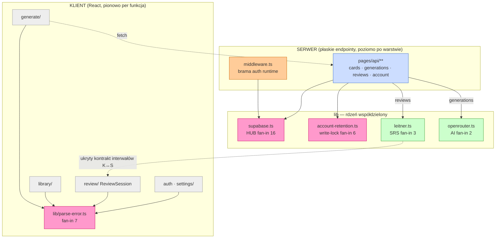

# Repo Map — 10xCards

> Dokument onboardingowy dla nowego architekta/maintainera. Synteza trzech map:
> **gdzie system żył** ([artifact-1-territory](artifact-1-territory.md), historia gita),
> **jak jest zbudowany** ([artifact-2-structure](artifact-2-structure.md), graf importów),
> **kto trzyma wiedzę** ([artifact-3-contributors](artifact-3-contributors.md), autorstwo).
> Pełne tabele i dowody — w artefaktach źródłowych; tu jest złączony obraz i ścieżka wejścia.
>
> **Zastrzeżenie na wstępie:** to mapa **aktywności i struktury w oknie ~26 dni**
> (cała historia repo: 178–181 commitów, 2026-05-20 → 2026-06-15). Pokazuje *koncentrację
> wczesnego developmentu*, nie wzorce długoterminowego utrzymania. Patrz §8.
>
> **Znaczniki dowodu (używane w całym dokumencie):** **[graf]** = graf importów
> dependency-cruiser (tylko TS/TSX) · **[historia]** = git log / współzmiany ·
> **[unknown]** = poza zasięgiem narzędzi (np. `.astro`, SQL, część stacku bez grafu) ·
> **[regen]** = zmienia się razem, bo jest generowane/mockowane, a nie ręcznie edytowane
> (tańszy rodzaj sprzężenia niż edycja ręczna).

## 1. TL;DR

10xCards to AI-assisted spaced-repetition flashcard MVP (Astro 6 + React 19 + TS, Supabase
auth/DB, Cloudflare Workers). Produkt dzieli się czysto na **klienta** (foldery React per
funkcja: generate / library / review / auth / settings) i **serwer** (płaskie endpointy
`pages/api/**` + współdzielony rdzeń `src/lib`). Praca skupiła się w `src/pages/api`
(najgorętszy realny obszar) i `src/lib`; **dwie trzecie całego churnu to szum AI-workflow**
(`context/`, `.claude/`), który trzeba odfiltrować, by zobaczyć realny sygnał **[historia]**.
Strukturalne centrum grawitacji to **infrastruktura** — `src/lib/supabase.ts`, fan-in 16 —
a nie headline-feature „AI", który jest dobrze odizolowaną wąską szprychą **[graf]**. Graf
jest nietypowo zdrowy (**0 cykli, 0 sierot, 0 naruszeń reguł**) — efekt jawnych boundaries
egzekwowanych od początku. Boli tam, gdzie największy zasięg zmiany spotyka się z najcieńszym
śladem (warstwa danych/auth/inwariantu zapisu), a dominujące ryzyko nie jest strukturalne,
tylko **wiedzowe**: jeden ludzki autor, **bus factor = 1**, a „dlaczego" wielu decyzji żyje
w wygasłych sesjach AI, nie w docs.

> Granica klient/serwer jest **realna, nie tylko deklarowana**: żaden komponent nie
> importuje `supabase` / `openrouter` / `retention` bezpośrednio (Artifact 2 §3). **[graf]**

## 2. Teren — głębokie vs peryferyjne, aktywność w czasie

**Duża odpowiedzialność (głębokie, gorące):**
- `src/pages/api` — **najgorętszy realny obszar** (25 zmian). Epicentrum logiki biznesowej:
  generowanie AI, zapis kart, powtórki, usuwanie konta. **[historia]**
- `src/lib` — rdzeń współdzielony (supabase, leitner, openrouter, observability,
  account-retention). Mała powierzchnia, **wielki zasięg** (§3). **[graf]**
- `src/middleware.ts` — jeden plik, ale brama auth spinająca wszystkie chronione trasy.

**Peryferia / płytkie:** `src/layouts` (jeden layout), `src/components/ui` (prymitywy),
`src/components/settings`. Komponenty są dobrze odseparowane per funkcja — **nie ma
komponentu-molocha**; churn idzie wzdłuż granic funkcji. **[historia]**

**Aktywność w czasie** (cała historia to ~4 tygodnie; kwartały bez sensu): fundament
(auth/schema, W20) → szczyt feature'ów (generowanie, SRS, atomic-save, W21) → **pik
hardeningu** (RLS/izolacja, testy odporności, Sentry — W22, 107 commitów) → cisza
(W23–24, tylko manifesty lekcji). **Trajektoria: budowanie → bezpieczeństwo i niezawodność
→ wygaszenie.** Warstwa hardeningu jest więc *najmłodsza i najmniej dojrzała*. **[historia]**

> **Pułapka metryk:** dwie trzecie churnu to artefakty AI-workflow (`context/`, `.claude/`),
> w tym renamy `change.md → archive/` (zamykanie zmian, nie kod) **[regen]**. Każda analiza
> częstotliwości MUSI je filtrować, inaczej `src/` znika w statystykach.

## 3. Realne powiązania — co naprawdę zmienia się razem

Dwie **różne osie tego samego ryzyka** — obie prawdziwe, wskazują różne pliki:

| Oś | Wspólny mianownik | Źródło | Co znaczy |
|---|---|---|---|
| **Strukturalna** (importy) | `src/lib/supabase.ts` (fan-in 16) | **[graf]** | Zmiana klienta/sesji/typów ripuje przez middleware + **każdy** endpoint |
| **Runtime'owa** (brama) | `src/middleware.ts` | **[historia]** + `PROTECTED_ROUTES` | Fan-in 0 w grafie (artefakt: `.astro` niewidoczne), ale błąd odsłania wszystkie chronione trasy |

**Łańcuch największego blast radius (graf importów):** `supabase.ts` (16) →
`account-retention.ts` (6, **wszystkie zapisy**) → `parse-error.ts` (7, **całe UI błędów**). **[graf]**

**Współzmiany z gita** potwierdzają oś rdzeń+brama+trasy: `src/lib` ↔ `context/changes` (11),
`src/pages/api` ↔ `context/changes` (10), `middleware.ts` ↔ trasy (5). Backend jest sterowany
feature'ami: każdy nowy feature = nowy endpoint + dotknięcie `src/lib`. **[historia]**

**Ukryte sprzężenie (uwaga!):** `leitner.ts` jest **współdzielony przez granicę** klient↔serwer.
Zmiana interwałów SRS wymaga **ręcznej** synchronizacji `ReviewSession.tsx` ↔ `reviews.ts` —
nigdzie nie wymuszona mechanicznie. Jeden kontrakt, dwa końce: „wiesz albo psujesz"
(Artifact 2 §4/§6). **[graf]**

**Cross-cutting inwariant zapisu:** `account-retention.ts` (fan-in 6) wpina się w *każdy*
mutujący endpoint (cards, generations×3, reviews). Nazwa folderu („usuwanie konta")
**ukrywa**, że to globalny aspekt — każda nowa ścieżka zapisu MUSI uwzględnić write-lock. **[graf]**

**Cykle:** brak (DAG). Realny atut — każdy moduł da się prześledzić w jedną stronę
i testować w izolacji. **[graf]**

> **Czego graf NIE objął** (`unknown`, nie „brak powiązań"): depcruise widzi tylko TS/TSX.
> **Importy z plików `.astro` nie liczą się do fan-in** — dlatego `middleware.ts`, strony
> `.astro` i `config-status.ts` mają fan-in 0 mimo realnego użycia; to **artefakt metody,
> nie martwy kod**. Warstwy `supabase/` (SQL, migracje, RLS) i Cloudflare/`wrangler` są
> **poza grafem** — ich sprzężenia znamy tylko z historii gita i prozy, nie ze statycznej
> analizy. **[unknown]**

## 4. Strefy ryzyka

| Strefa | Dlaczego ryzykowna (1 linia) |
|---|---|
| 🔴 **Supabase / DB + RLS** | Hub fan-in 16; RLS to subtelna poprawność bezpieczeństwa; migracje **remote-only** (łatwo o nieodwracalny błąd); model mentalny **zwietrzały** (projektowane wcześnie). **[graf + historia]** |
| 🔴 **Account-retention / write-lock** | Globalny inwariant przecinający **wszystkie zapisy** (fan-in 6), a ślad historii to **2 commity w jeden dzień** — max zasięg, min śladu. **[graf + historia]** |
| 🟡 **Reviews / SRS (Leitner)** | Ciche sprzężenie interwałów przez granicę klient↔serwer — zmiana w jednym miejscu po cichu rozjeżdża drugie. **[graf]** |
| 🟡 **Generowanie + AI (OpenRouter)** | Headline-feature, ale ścieżki błędu LLM (timeout/odmowa) **wyglądają na słabo pokryte — do weryfikacji, nie zakładaj**; strukturalnie dobrze odizolowany (fan-in 2). **[graf]** |
| 🟡 **Observability / Sentry** (operacyjne) | Najmłodsza, najmniej dojrzała warstwa; działa tylko z **Cloudflare Build Variable** (wiedza plemienna), trudna do odtworzenia lokalnie. Ryzyko = utrata telemetrii, nie (dowiedzione) złamanie runtime. **[historia]** |
| 🟡 **Deploy + Auth** | **CI nie bramkuje `main`** (workflow odpala na `master`; gałąź robocza to `main`) → brak zielonej bramki; `middleware.ts` / `PROTECTED_ROUTES` mały, ale runtime-krytyczny. **[historia + config repo]** |

> **Co łagodzi ryzyko:** najryzykowniejsze inwarianty są **zakute mechanicznie** —
> `retention-write-lock.test.ts` (kontraktowy, fan-out 9), `no-service-role-in-src`,
> two-user isolation, oraz 8 reguł boundaries w `.dependency-cruiser.cjs`. To **jedyna
> wiedza w repo niezależna od pamięci autora** — i sama jest meta-ryzykiem: maintainer,
> który nie rozumie *po co* dany guardrail istnieje, może go osłabić i nie zauważyć regresji.

## 5. Kogo zapytać (per strefa)

Bus factor = **1 wszędzie**: jedyny ludzki autor to **Rafal S**. AI to *narzędzie*, nie
kontrybutor (43% commitów w parze z Claude). Różnicuje go **wersja modelu-para** (czyj
kontekst sesji niesie rozumowanie) i **świeżość** modelu mentalnego. **[historia]**

| Strefa | Kto / co | Niuans |
|---|---|---|
| Supabase / RLS | Rafal (para: **Opus 4.7**) | zwietrzała; pytasz inną wersję modelu niż ta, która projektowała |
| Account-retention | Rafal (para: Opus 4.7) | całe „dlaczego" w 2 commitach + (wygasłej) sesji AI |
| Observability | Rafal (para: **Opus 4.8**) | seam „swallow fix", wymóg Cloudflare Build Variable |
| Generowanie + AI | Rafal (para: 4.7→4.8) | 9/9 commitów z AI — rozumowanie żyło w oknie czatu |
| Reviews / SRS | Rafal (para: 4.7) | sync interwałów klient↔serwer = wiedza plemienna |
| Deploy / Infra | Rafal (para: mieszana, **najświeższa**) | remote-only Supabase, CF Workers, deploy dev→main, sekrety w CF/GH |

> **Rozjazd wersji = rozjazd kontekstu.** Fundament (auth, schema, SRS, generowanie)
> powstał w parze z Opus 4.7; najnowsza warstwa (observability, testing) — z Opus 4.8.
> Kontekst sesji nie jest przenośny między wersjami — realna luka mimo „jednego kontrybutora".
> **Wiedza do spisania w pierwszej kolejności**, gdyby doszedł drugi maintainer: *dlaczego*
> write-lock obejmuje wszystkie zapisy; *jak* odtworzyć Sentry lokalnie bez CF build-var;
> *które* interwały Leitnera są źródłem prawdy przy rozjeździe; *dlaczego* remote-only Supabase.

## 6. Self-perception vs evidence

Model mentalny właściciela i miejsca, gdzie artefakty go korygują (Artifact 1 §6,
Artifact 2 §6–7):

| Percepcja właściciela | Dowód | Konsekwencja dla architekta |
|---|---|---|
| Generowanie AI to sedno. | `openrouter.ts` fan-in **2** — wąska szprycha **[graf]** | Headline-feature jest strukturalnie **peryferyjny** (plus: trywialnie wymienić providera). |
| Najryzykowniejsze to OpenRouter + Supabase. | Supabase **tak** (hub 16); OpenRouter jest *najbezpieczniejszy* do zmiany **[graf]** | Niedoceniane ryzyko to **`account-retention`** (cross-cutting, ślad 2 commitów). |
| `src/lib` to jedna rzecz. | Dzieli się na Supabase / OpenRouter / Leitner / observability / retention **[graf]** | Traktuj każdy wg jego blast radius, nie jako jeden „lib". |
| SRS/Leitner jest strukturalnie centralny. | Niski fan-in (3), ale **współdzielony przez granicę** **[graf]** | Centralny w *znaczeniu*, nie strukturze; wymaga ręcznej sync klient↔serwer. |
| Backend jest „per feature" jak komponenty. | Komponenty SĄ per-feature; API **płaskie** pod `pages/api/`, sprzężone przez **warstwę lib** **[graf]** | Frontend tnie pionowo, backend poziomo. „Funkcja review" to jeden folder w UI, ale na serwerze rozsmarowana: `reviews.ts` + supabase + retention + leitner. |
| Dość mały, by trzymać w głowie. | Jeden autor, 26 dni — ale wiedza podzielona między kod i **wygasłe sesje AI** (różne wersje modelu) **[historia]** | Już nieodtwarzalny w pełni z repo; nie licz, że zostanie „w głowie". |

> **Sedno:** w centrum stoi **infrastruktura** (`supabase.ts`), a domenowa sygnatura
> (SRS, AI) leży na peryferiach jako małe, dobrze odizolowane moduły. To nie wada — to
> konsekwencja świadomej architektury. Ale nawigując „po funkcji" pamiętaj: funkcja w UI =
> jeden folder, na serwerze = warstwa lib + płaski endpoint + cross-cutting retention.

## 7. Pierwszy dzień — co przeczytać, w kolejności

Ścieżka od największej dźwigni do feature'a, którego pewnie dotkniesz najpierw:

1. **`AGENTS.md` + `CLAUDE.md`** — tripwires: CI nie bramkuje `main`, husky re-staging,
   nienadpisywanie `context/`. Zacznij tu — to jedyna „proza" o decyzjach.
2. **`src/lib/supabase.ts`** — hub fan-in 16. Zrozum go, zanim ruszysz cokolwiek na
   serwerze; to najniebezpieczniejszy pojedynczy punkt zmiany.
3. **`src/middleware.ts`** — brama auth + `PROTECTED_ROUTES`. Mała powierzchnia, runtime
   blast radius = wszystkie chronione trasy.
4. **`src/lib/account-retention.ts`** + **`test/integration/retention-write-lock.test.ts`** —
   przeczytaj razem. Test **wymusza** inwariant, którego nazwa folderu nie zdradza.
5. **`src/pages/api/reviews.ts`** + **`src/lib/leitner.ts`** +
   **`src/components/review/ReviewSession.tsx`** — prześledź ukryte sprzężenie interwałów
   SRS przez granicę klient↔serwer.
6. **`src/pages/api/generations.ts`** + **`src/lib/openrouter.ts`** — headline-feature
   i jedyny styk z zewnętrznym LLM-em (ścieżki błędu słabo pokryte).
7. **`.dependency-cruiser.cjs`** — 8 reguł boundaries. Tu zapisana jest „intencja
   architektoniczna", którą reszta repo respektuje.
8. *(opcjonalnie)* wyrenderuj blast radius:
   `npx depcruise src --focus "src/lib/supabase.ts" --output-type dot | dot -Tsvg > context/map/supabase-blast-radius.svg`
   — patrz [supabase-blast-radius.svg](supabase-blast-radius.svg).

> **Jak wejść w ten projekt:** nawiguj **dwiema różnymi mapami zależnie od intencji.** By
> zmienić *zachowanie produktu*, nawiguj **po funkcji** (foldery klienta to uczciwe pionowe
> slice'y). By zmienić *auth / dane / sesję / zapis*, ignoruj nazwy folderów i nawiguj
> **po hubie infrastruktury i blast radius** (§3). Przed każdą zmianą w strefie 🔴 znajdź
> guardrail-test, który już pilnuje inwariantu, i uczyń go swoją specyfikacją.

## 8. Ograniczenia — czego ta mapa NIE mówi

- **Okno = cała historia repo, ~26 dni** (178–181 commitów, 2026-05-20 → 06-15). To mapa
  **aktywności i struktury w młodym projekcie**, nie wieloletniego legacy. „Zwietrzała"
  wiedza oznacza tu tygodnie, nie lata.
- **Metoda — trzy źródła, trzy ślepe plamy:** historia gita (co dotykano, nie co ważne),
  graf importów depcruise (tylko TS/TSX — **`.astro` i SQL/migracje poza grafem**), trailery
  commitów (wersja modelu-para ≠ ekspertyza człowieka).
- **`unknown`, nie „brak powiązań":** warstwy bez grafu (Astro pages, `supabase/` SQL,
  Cloudflare/`wrangler`) mogą mieć sprzężenia, których ta mapa nie widzi. Fan-in 0 dla
  `.astro`/`middleware.ts` to **artefakt metody**, nie martwy kod. **[unknown]**
- **Sprzężenie przez regenerację ≠ ręczna edycja:** churn `context/`, `.claude/` i
  `.10x-cli-manifest.json` jest **generowany/procesowy** **[regen]** — tańszy rodzaj zmiany,
  odfiltrowany z rankingów kodu. Nie wnioskuj z niego o architekturze.
- **Mapa nie ocenia jakości kodu** ani poprawności biznesowej — mówi tylko, gdzie rzeczy
  żyją, co ma szeroki zasięg i kogo (oraz którą sesję AI) zapytać.

---

*Synteza z [artifact-1-territory.md](artifact-1-territory.md) (historia gita),
[artifact-2-structure.md](artifact-2-structure.md) (dependency-cruiser: 60 modułów / 134
zależności, 0 cykli / 0 sierot / 0 naruszeń) i
[artifact-3-contributors.md](artifact-3-contributors.md) (git log / trailery / autorstwo).
Artefakty źródłowe pozostają niezmienione — szczegółowe tabele i dowody tam.*
